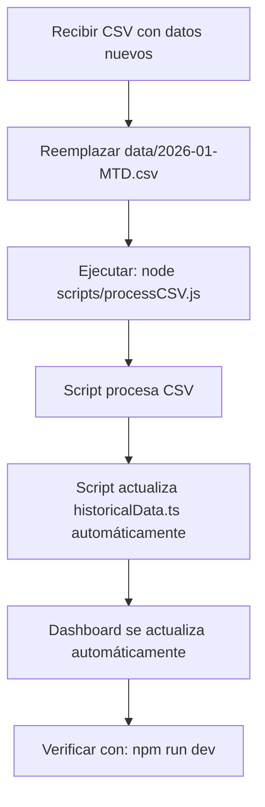

# Guía de Actualización de Datos del Dashboard

Este documento explica cómo actualizar los datos del dashboard de pagos cuando se recibe un nuevo archivo CSV con información más reciente.

## ⚡ Proceso Simplificado - SOLO 2 PASOS

El dashboard es **totalmente dinámico** y se ajusta automáticamente al número de días disponibles.

### Actualización Diaria (Proceso Normal):

1. **Reemplazar el archivo CSV**
   - Ubicación: `data/2026-01-MTD.csv`
   - **Importante**: El nombre del archivo NO cambia (`2026-01-MTD.csv`)
   - Solo reemplaza el contenido con los datos más recientes

2. **Ejecutar el script**
   ```bash
   node scripts/processCSV.js
   ```

**¡Eso es TODO!** 🎉 El script automáticamente:
- ✅ Lee el archivo CSV
- ✅ Convierte timestamps UTC → México (UTC-6)
- ✅ Detecta el último día disponible
- ✅ Calcula totales y promedios
- ✅ **Actualiza automáticamente `historicalData.ts`**
- ✅ El dashboard se actualiza completamente

**No necesitas:**
- ❌ Copiar datos manualmente
- ❌ Modificar código
- ❌ Cambiar fechas manualmente
- ❌ Actualizar contadores
- ❌ Ajustar rangos de días

---

## 🕐 Zona Horaria - PREGUNTA FRECUENTE

### "¿Por qué veo fechas del día 23 si el dashboard muestra día 22?"

✅ **Es correcto.** Los datos vienen en UTC y el script convierte a hora de México (UTC-6).

**Ejemplo visual:**
```
CSV muestra:    2026-01-23 05:00:00.000
                ↓ El script resta 6 horas
Dashboard usa:  2026-01-22 23:00:00 (hora de México)
```

**Explicación:**
- 5:00 AM UTC del día 23 = 11:00 PM del día 22 en México
- Las primeras 6 horas del día 23 en UTC son las últimas 6 horas del día 22 en México
- El script automáticamente asigna estas horas al día correcto

### Desfase Aparente de Días

Es **NORMAL** ver en el archivo CSV:
```csv
2026-01-23 05:00:00.000,35
2026-01-23 04:00:00.000,50
2026-01-23 03:00:00.000,73
```

Cuando el dashboard muestra **día 22**.

**¿Por qué?**
- Horas 0:00-5:59 del día 23 UTC = Horas 18:00-23:59 del día 22 México
- El script convierte automáticamente al día correcto
- **NO hay error, es la conversión correcta de zona horaria**

⚠️ **No intentes "corregir" esto manualmente**

---

## 📋 Formato del Archivo CSV

```csv
"datefloor(@timestamp - 21600000, 1h) + 21600000",total_events
2026-01-23 05:00:00.000,35
2026-01-23 04:00:00.000,50
2026-01-23 03:00:00.000,73
...
```

- **Primera columna**: Timestamp en formato `YYYY-MM-DD HH:00:00.000` (UTC)
- **Segunda columna**: Número de eventos/pagos en esa hora
- **El script convierte automáticamente a hora de México (UTC-6)**

---

## 🚀 ¿Qué Hace el Script Automáticamente?

Cuando ejecutas `node scripts/processCSV.js`, el script:

1. ✅ Lee el archivo `data/2026-01-MTD.csv`
2. ✅ Convierte timestamps UTC → México (UTC-6)
3. ✅ **Detecta automáticamente el último día disponible**
4. ✅ Agrega datos por día y por hora
5. ✅ Calcula totales y promedios
6. ✅ **Actualiza automáticamente `src/data/historicalData.ts`** con:
   - Array `historicalData` (datos diarios)
   - Valor `totals['2026']` (total del año actual)
   - Array `hourlyDistribution` (distribución horaria)

**Después de ejecutar el script**, el dashboard automáticamente actualiza:
- ✅ Último día disponible (calculado del array)
- ✅ Promedios diarios (dinámicos)
- ✅ Contadores de días laborales/fin de semana (dinámicos)
- ✅ Rangos de períodos (semanas 1, 2, 3+) - dinámicos
- ✅ Fechas en headers y títulos - dinámicas
- ✅ Rangos de proyección (forecast) - dinámicos
- ✅ Máximos históricos - dinámicos
- ✅ Mapas de calor - dinámicos
- ✅ Todos los textos dinámicos en la UI

---

## 🔧 Funciones Helper Dinámicas (Información Técnica)

El archivo `historicalData.ts` incluye funciones que calculan automáticamente:

| Función | Descripción |
|---------|-------------|
| `lastAvailableDay` | Último día disponible en los datos (ej: 22) |
| `totalDaysAvailable` | Total de días con datos (ej: 22) |
| `remainingDays` | Días restantes del mes (ej: 9) |
| `calculateDynamicWeekdayCount(year)` | Conteo dinámico de días L-V vs S-D |
| `calculatePeriodRanges()` | Rangos dinámicos de semanas |
| `getHistoricalMax()` | Máximo histórico de todos los años |
| `formatDayMonth(day)` | Formato de fecha en español |

---

## ✅ Checklist Rápido

### Actualización Diaria:
- [ ] Reemplazar `data/2026-01-MTD.csv` con datos nuevos
- [ ] Ejecutar: `node scripts/processCSV.js`
- [ ] Verificar con: `npm run dev`

**¡Eso es todo!** Los datos se actualizan automáticamente.

---

## 📝 Resumen Final

### Para actualizar datos en el futuro:

**Paso 1**: Reemplazar `data/2026-01-MTD.csv` con datos nuevos
**Paso 2**: Ejecutar `node scripts/processCSV.js`

**¡Eso es todo!** 🎉

**Lo que el script hace automáticamente:**
- ✅ Procesa el CSV
- ✅ Convierte zona horaria
- ✅ Detecta último día disponible
- ✅ Calcula totales y promedios
- ✅ **Actualiza `historicalData.ts` automáticamente**

**Lo que el dashboard calcula automáticamente después:**
- ✅ Promedios diarios
- ✅ Fechas en títulos
- ✅ Contadores de días
- ✅ Rangos de semanas
- ✅ Proyecciones
- ✅ Máximos históricos
- ✅ Todo el dashboard

---

## 🔗 Flowchart del Proceso



---

## ❓ Preguntas Frecuentes

**P: ¿Por qué el CSV muestra día 23 pero el dashboard día 22?**  
R: Conversión de zona horaria UTC → México. Es correcto. Ver sección "Zona Horaria" arriba.

**P: ¿Debo cambiar el nombre del archivo CSV?**  
R: NO. Siempre se llama `2026-01-MTD.csv`. Solo reemplaza el contenido.

**P: ¿Necesito copiar datos manualmente?**  
R: NO. El script actualiza automáticamente `historicalData.ts`.

**P: ¿Qué significa MTD?**  
R: "Month To Date" (mes hasta la fecha actual).

**P: ¿El script detecta automáticamente cuántos días hay?**  
R: SÍ. No necesitas especificar nada, lee el CSV y detecta el último día.

**P: ¿Qué pasa si hay un error?**  
R: El script mostrará un mensaje de error. Verifica que el archivo CSV esté en el formato correcto.
